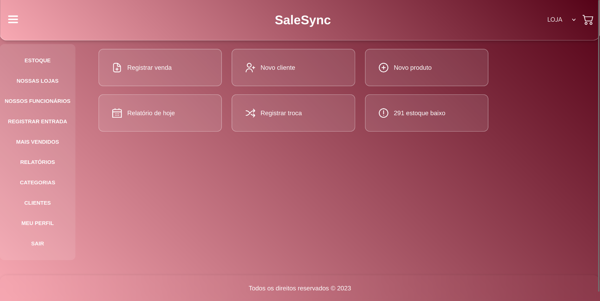

# 🛍️ Sistema Web para Loja

Sistema desenvolvido para administração de vendas e controle de estoque, utilizado por uma loja real. O projeto nasceu como Trabalho de Conclusão de Curso (TCC) e evoluiu para um sistema completo, em uso prático.

## 🚀 Funcionalidades

- Cadastro e controle de produtos e estoque
- Registro de vendas e trocas
- Geração de relatórios dinâmicos (vendas, estoque, vales)
- Estimativa de tempo de duração do estoque
- Filtros de pesquisa por período, categoria e outros
- Responsividade para diferentes dispositivos
- Gestão de vales de clientes e trocas de mercadoria

## 🛠️ Tecnologias e Ferramentas

- **Linguagens**: PHP, JavaScript, HTML, CSS
- **Banco de Dados**: MySQL (usando PhpMyAdmin)
- **Modelagens**: UML (casos de uso, diagrama de classes)
- **Outros**: SQL, lógica de negócio, manipulação de datas e cálculos automáticos

## 🎯 Objetivo

Solução prática para gerenciamento completo de uma loja, unindo aprendizado acadêmico com aplicação real. O projeto envolveu:

- Levantamento de requisitos com o cliente
- Análise de problemas reais
- Modelagem e desenvolvimento do sistema completo
- Evolução contínua com novas funcionalidades conforme uso

## 🧩 Desafios Técnicos

O planejamento do banco de dados foi uma etapa central no projeto. A estrutura foi pensada para suportar operações complexas e permitir a geração de relatórios, controle preciso de estoque, trocas e vales. A modelagem relacional clara foi essencial para a escalabilidade e manutenção do sistema.

🧠 Este projeto também foi um exercício de resiliência. Desenvolvido como Trabalho de Conclusão de Curso, envolveu prazos curtos, pressão por qualidade e responsabilidade em entregar um sistema funcional real. Foi necessário manter o foco, gerenciar o tempo e lidar emocionalmente com a carga do processo — habilidades que considero tão importantes quanto o código.

## 🧩 Modelagem e Normalização

O banco de dados foi cuidadosamente modelado e normalizado para garantir consistência, evitar redundâncias e permitir escalabilidade. A estrutura contempla relacionamentos bem definidos, integridade referencial e suporte a operações complexas, como relatórios personalizados e previsão de esgotamento de estoque.

## 📸 Imagens

## 📁 Organização do Código

/backend # Scripts PHP, conexão com o BD, controllers
/frontend # HTML, CSS, JS
/database # Script SQL do banco de dados
/docs # Modelagens UML e documentação do projeto

## 👩‍💻 Desenvolvido por

Giovanna Dequi – Técnica em Desenvolvimento de Sistemas, aluna de ADS, desenvolvedora Web focada em soluções reais.

